<div align="center">

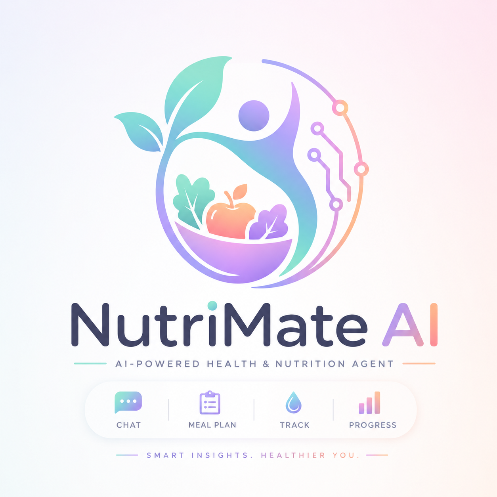

# NutriMate AI

### Your Personal AI Nutrition Research & Action Agent

*Smart insights. Healthier you.*

[](https://www.python.org/)
[](https://fastapi.tiangolo.com/)
[](https://www.anthropic.com/)
[](#license)
[](#contribution-guidelines)

</div>

---

## Table of Contents

- [Overview](#overview)
- [Why an Agent, Not a Chatbot](#why-an-agent-not-a-chatbot)
- [Features](#features)
- [Architecture](#architecture)
- [Agentic Workflow](#agentic-workflow)
- [Screenshots](#screenshots)
- [Technology Stack](#technology-stack)
- [Project Structure](#project-structure)
- [Installation](#installation)
- [Quick Start](#quick-start)
- [Usage Examples](#usage-examples)
- [Security & Privacy](#security--privacy)
- [Roadmap](#roadmap)
- [Contribution Guidelines](#contribution-guidelines)
- [License](#license)
- [Contact](#contact)

---

## Overview

Generic diet advice doesn't work because no two bodies, schedules, or goals are the same. **NutriMate AI** is a full-stack health and nutrition agent that combines a real calorie/macro calculator, persistent food and water logging, and a Claude-powered assistant that doesn't just *talk about* your nutrition — it **acts** on it.

Say "I had two eggs and toast" in the chat, and NutriMate estimates the nutrition and logs it to your diary automatically. Ask "how am I doing today?" and it pulls your actual logged totals before answering — no guessing, no generic advice detached from your real data.

**Built as an industrial training project** to demonstrate a complete, production-shaped AI agent: authentication, a relational data model, tool-calling LLM integration, and a polished frontend, all in one repository.

---

## Why an Agent, Not a Chatbot

| Ordinary Chatbot | NutriMate AI Agent |
|---|---|
| Answers questions in isolation | Grounds every answer in your real logged data |
| Forgets what you tell it | Persists meals, water, and weight to a database |
| You manually log everything | Understands natural language and logs it *for* you |
| Generic advice | Personalized to your BMR/TDEE/macro targets |

This is powered by **Claude's tool-use (function-calling)** — the model decides when an action is needed and calls a real backend function, not a scripted `if/else` chain.

---

## Features

| Category | Capability |
|---|---|
| 🔐 **Secure Auth** | Bcrypt-hashed passwords, token-based sessions |
| 🧬 **Health Calculator** | BMI, BMR, TDEE, and macro targets via the Mifflin-St Jeor formula |
| 🤖 **AI Action Agent** | Claude tool-calling to log meals, water & weight straight from natural chat |
| 🍽️ **AI Meal Planning** | Personalized daily meal plans generated from your saved profile |
| 💡 **Daily AI Tips** | Fresh, evidence-based nutrition tips on every visit |
| 📝 **Manual Logging** | Full food diary and water tracker for when you'd rather type it yourself |
| 📈 **Progress Charts** | Live macro breakdown (Chart.js doughnut) and weight trend line chart |
| 🎨 **Soft, Modern UI** | Glassmorphism design system built to feel calm, not clinical |

---

## Architecture

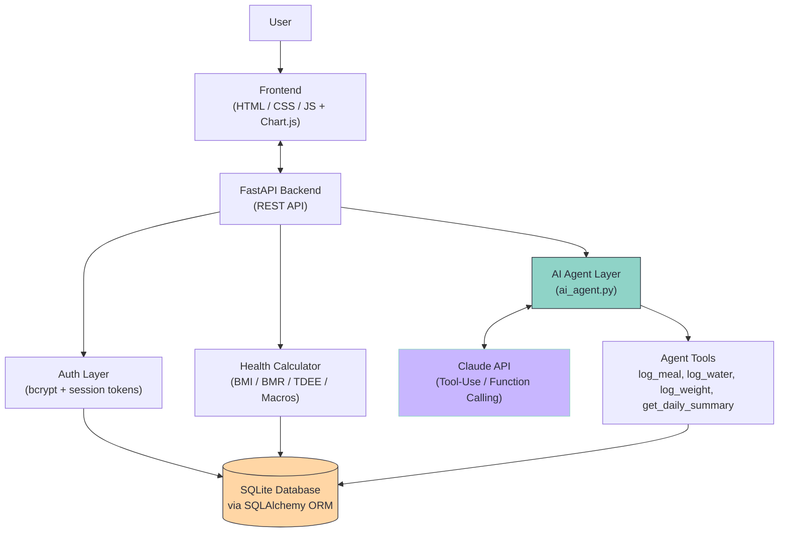

---

## Agentic Workflow

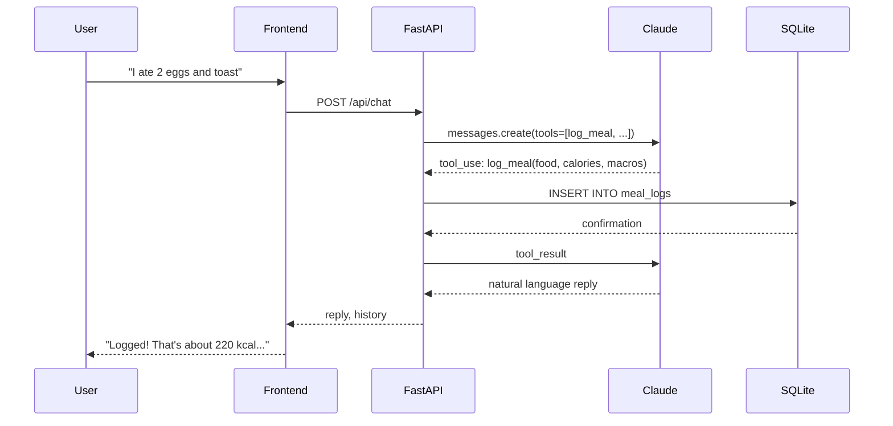

---

## Screenshots

<table>
<tr>
<td width="50%">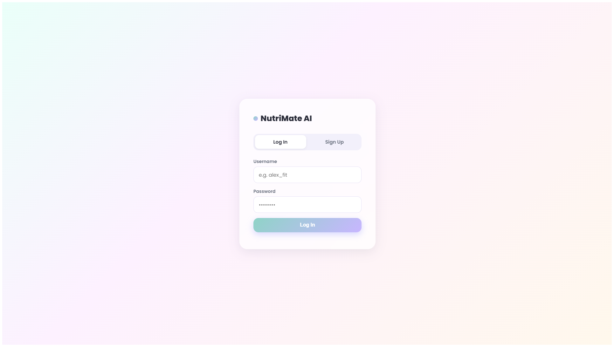<p align="center"><b>Log In</b></p></td>
<td width="50%">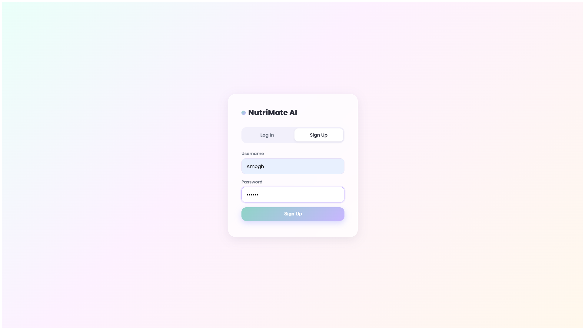<p align="center"><b>Sign Up</b></p></td>
</tr>
<tr>
<td width="50%">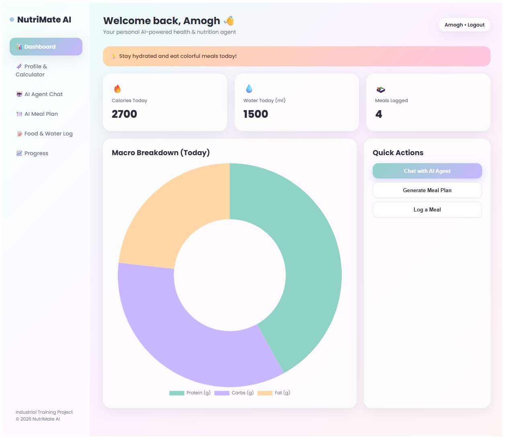<p align="center"><b>Dashboard</b></p></td>
<td width="50%">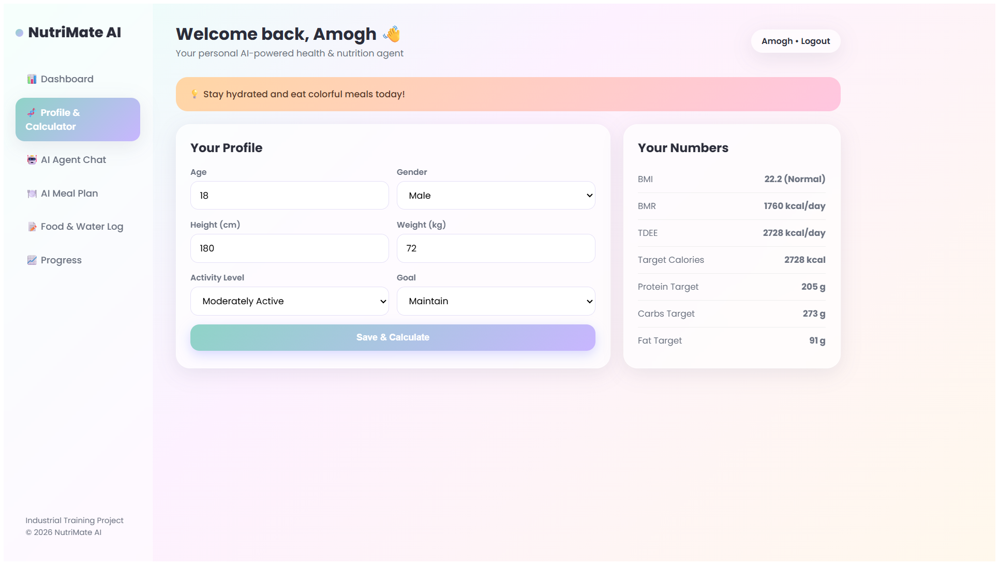<p align="center"><b>Profile & Calculator</b></p></td>
</tr>
<tr>
<td width="50%">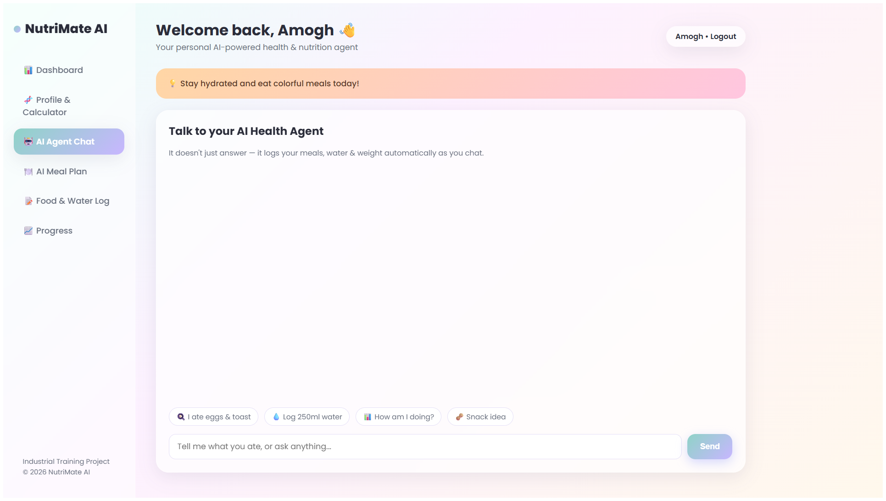<p align="center"><b>AI Agent Chat</b></p></td>
<td width="50%">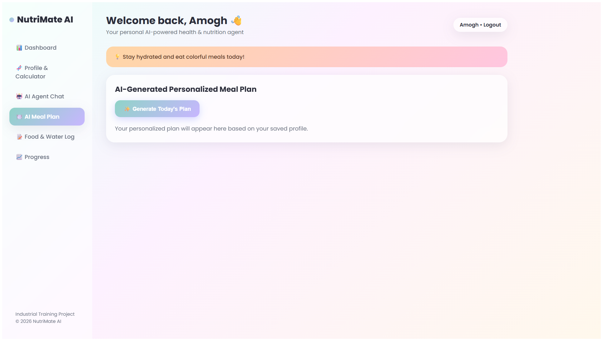<p align="center"><b>AI Meal Plan</b></p></td>
</tr>
<tr>
<td width="50%">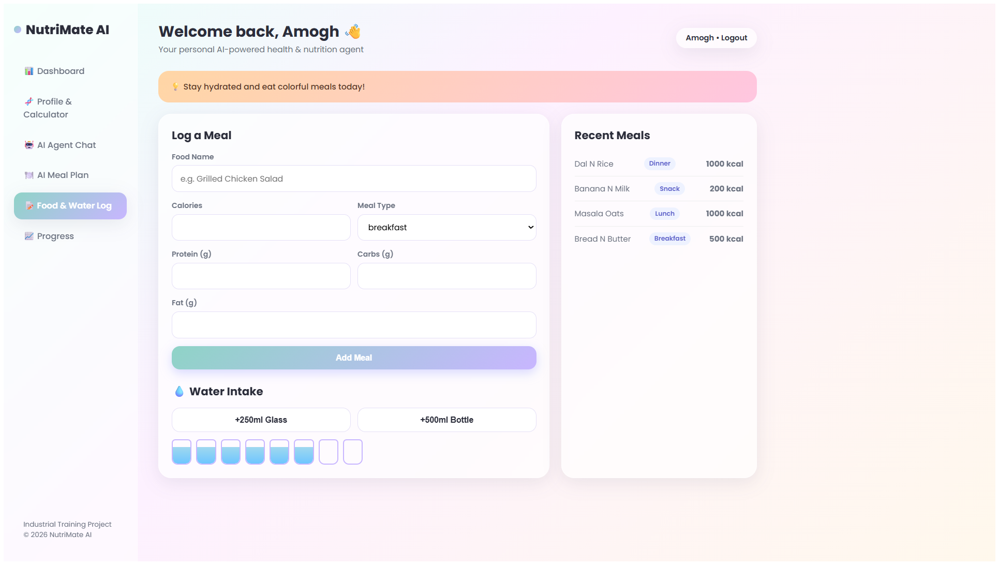<p align="center"><b>Food & Water Log</b></p></td>
<td width="50%">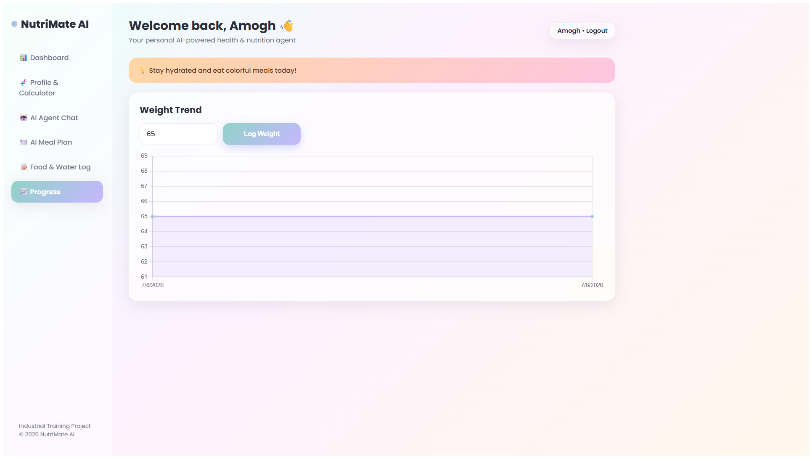<p align="center"><b>Progress Charts</b></p></td>
</tr>
</table>

---

## Technology Stack

| Layer | Technology |
|---|---|
| Backend Framework |  |
| Language |  |
| ORM / Database |   |
| AI Model |  |
| Server |  |
| Auth |  |
| Frontend |    |
| Charts |  |
| Deployment |  |

---

## Project Structure

nutrimate-ai/
├── backend/
│   ├── main.py           # FastAPI app & all REST endpoints
│   ├── ai_agent.py       # Claude tool-use agent + meal plan/tip generation
│   ├── models.py         # SQLAlchemy ORM models
│   ├── database.py       # DB engine/session setup
│   ├── requirements.txt
│   ├── .env.example      # Environment variable template
│   └── Procfile          # For platform deployment (Render/Railway)
├── frontend/
│   └── index.html        # Full single-page UI
├── logo/
│   └── logo.png
├── screenshots/
│   └── *.png
├── .gitignore
└── README.md

---

## Installation

**Prerequisites:** Python 3.10+, an [Anthropic API key](https://console.anthropic.com/)

```bash
# 1. Clone the repository
git clone https://github.com/amoghvijay/Nutrimate-ai.git
cd Nutrimate-ai/backend

# 2. Create and activate a virtual environment
python -m venv venv
venv\Scripts\activate        # Windows
# source venv/bin/activate   # macOS/Linux

# 3. Install dependencies
pip install -r requirements.txt

# 4. Configure environment variables
copy .env.example .env       # Windows
# cp .env.example .env       # macOS/Linux
# then edit .env and add your ANTHROPIC_API_KEY

# 5. Run the backend
uvicorn main:app --reload --port 8000
```

Open `frontend/index.html` in your browser (or serve it with VS Code Live Server). The frontend talks to `http://localhost:8000` by default.

---

## Quick Start

```bash
cd backend
venv\Scripts\activate
uvicorn main:app --reload --port 8000
```
Then open `frontend/index.html` → Sign Up → Set up your Profile → try the AI Agent Chat.

---

## Usage Examples

**Natural-language logging:**
> "I just had 2 boiled eggs and a slice of toast"
> → Agent estimates ~220 kcal, 14g protein, and logs it to your diary instantly.

**Grounded feedback:**
> "How am I doing today?"
> → Agent calls `get_daily_summary`, then replies using your *actual* totals — not a guess.

**Personalized planning:**
> Click *Generate Today's Plan* on the Meal Plan tab → returns a full day of meals sized to your saved BMR/TDEE targets.

---

## Security & Privacy

- Passwords are hashed with **bcrypt** — plaintext passwords are never stored.
- API keys live only in environment variables (`.env`), never committed to version control.
- Session tokens are required on every authenticated endpoint.
- The AI is prompted to give general nutrition guidance only, and to recommend professional medical consultation for health concerns — it never diagnoses.

> **Note:** This project uses simple in-memory sessions and SQLite for demonstration purposes. A production deployment would use persistent JWT sessions and a managed database (e.g., PostgreSQL).

---

## Roadmap

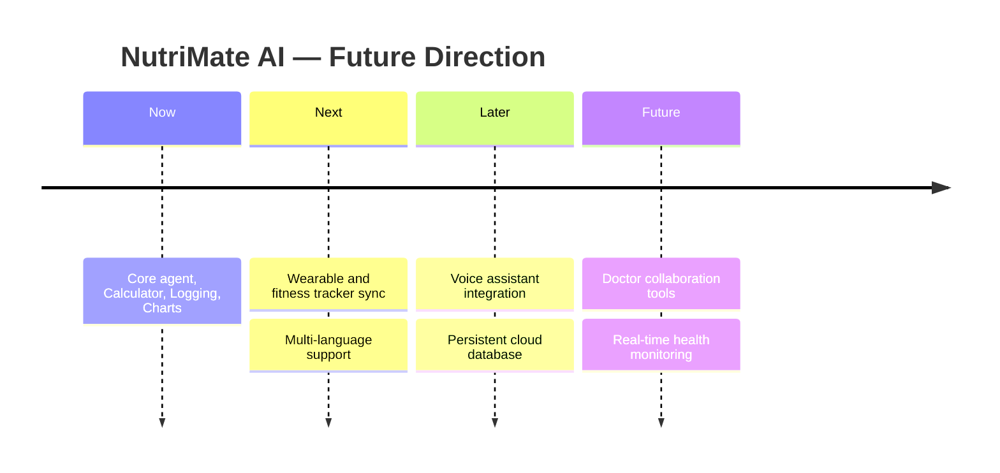

---

## Contribution Guidelines

Contributions are welcome!

1. Fork the repository
2. Create a feature branch (`git checkout -b feature/your-feature`)
3. Commit your changes with clear messages
4. Open a Pull Request describing what you changed and why

Please keep PRs focused — one feature or fix per PR — and follow existing code style (PEP8 for Python).

---

## License

This project is licensed under the **MIT License** — free to use, modify, and distribute with attribution.

---

## Contact

**Amogh Vijay**

[](https://github.com/amoghvijay)

---

<div align="center">

*Built with care for healthier lives through AI.*

</div>